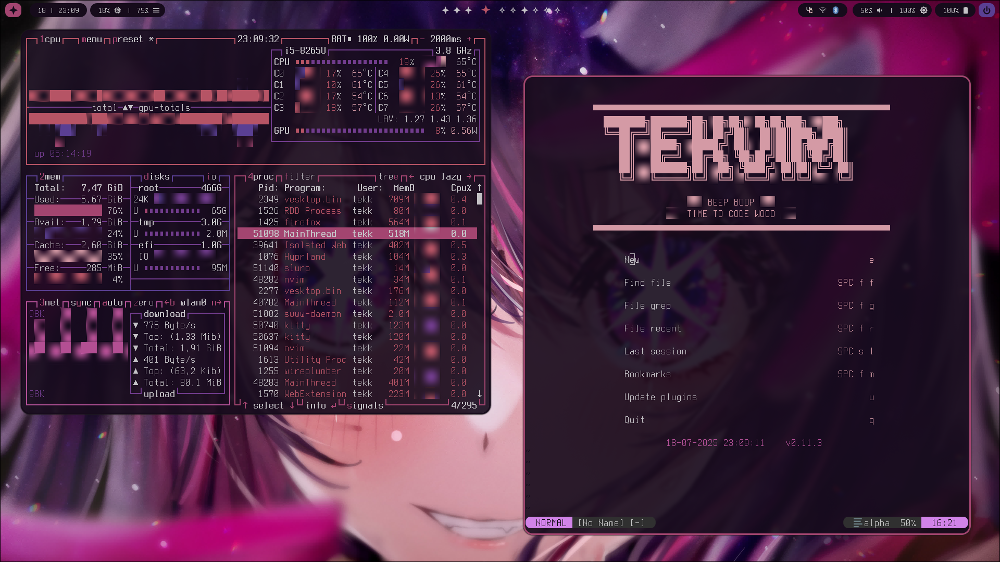

## HYPRTEKDOTS ##

Hi this my personal dotfiles repo. I made it to function with my [dotfile installer script](https://github.com/tekluna/tekkibles) but you can just look around and take what you like.

There are a few crappy scripts in there I use to automate stuff like changeing walpapers and syncing the colors using [`polybar`](https://github.com/dylanaraps/pywal)

##THE DOTFILES##
The dotfiles are scrucuted to be used with [GNU Stow](https://www.gnu.org/software/stow/), so you can just clone this repo and run `stow nameofpackage` to symlink the files into the correct places.
 
**packages**
  - bashrc
  - btop
  - eww
  - fastfetch (its ver broken)
  - hypr 
  - kitty 
  - nvim 
  - oh-my-posh
  - rofi
  - tmux
  - waybar

## Screenshots ##

